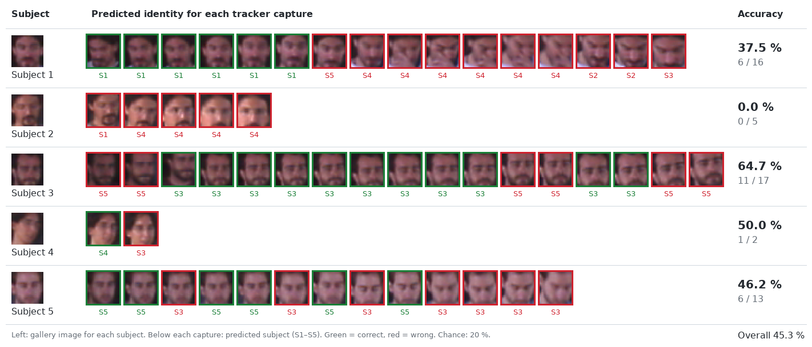
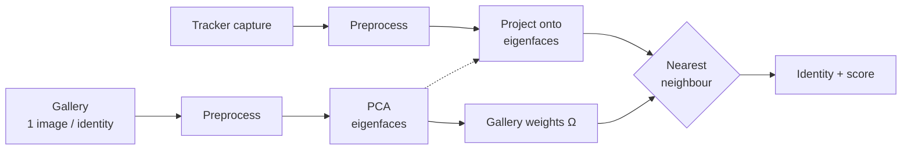
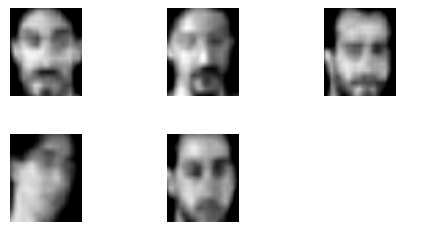
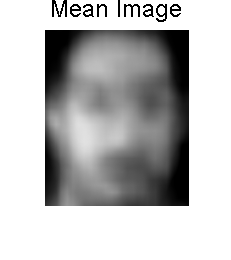
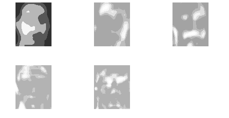

# Face-Assisted Head Tracking: an Eigenfaces Feasibility Study

> Can PCA face recognition on tiny, badly framed head crops from a
> surveillance-style tracker tell people apart well enough to help the tracker?

This repository contains the MATLAB code from coursework for the PhD course
**Biometric Techniques Applied to Security**, carried out at the
[Video Processing and Understanding Lab (VPU-Lab)](http://www-vpu.eps.uam.es/),
formerly the Grupo de Tratamiento de Imágenes (GTI), Universidad Autónoma de
Madrid, in July 2006. The code has been cleaned up and
modernized for publication. The algorithm and results are unchanged.

<p align="center">
  
</p>

## Motivation

Face recognition has a major advantage as a biometric: it can work without the
subject's cooperation. It is also very fragile. Resolution, pose, expression and
occlusion all affect it.

This study looks at a security-camera setting where faces are only about
**30×30 pixels**. The faces come from a **colour-histogram head tracker**: the
user marks a region on the first frame, and the tracker follows its colour
signature through the video. The tracker's region of interest has a fixed size,
so the crops it produces:

- often contain only part of the face,
- are rarely centred,
- contain no face at all when tracking is lost.

Full identification is unrealistic under these conditions. The question is
whether recognition is good enough to **discriminate between a handful of known
people**. That would let identity feed back into the tracker, for example to
recover after a lost track.

## Method

The system follows the classic eigenfaces approach (Turk & Pentland, 1991),
based on Drexel University's *EigenFace Tutorial*. PCA was chosen over LDA
because, as Martínez & Kak (2001) show, PCA can outperform LDA when the training
set is small. Here there is a single image per identity.



**1. Preprocessing.** Each image is resized to QCIF (176×144) with bilinear
interpolation. Its grey levels are then normalized to a fixed mean (100) and
standard deviation (80), which reduces the effect of lighting.

**2. Face space.** Stack the $M$ normalized gallery faces as columns
$\Gamma_1,\dots,\Gamma_M$ and subtract the mean face
$\Psi = \frac{1}{M}\sum_i \Gamma_i$ to get $A = [\Gamma_1-\Psi, \dots, \Gamma_M-\Psi]$.
The eigenfaces are the eigenvectors of the covariance $C = AA^\top$. This matrix
is $N \times N$ with $N \approx 25\,000$ pixels. Since $M \ll N$, the code
instead diagonalizes the small $M \times M$ matrix $L = A^\top A$ and maps each
eigenvector back with $u_k = A v_k / \lVert A v_k \rVert$.

<p align="center">
  
  
  
  <br><em>Normalized gallery · mean face · eigenfaces</em>
</p>

**3. Classification.** A probe face $\Gamma$ is projected onto the face space,
$\omega = U^\top(\Gamma - \Psi)$. It is assigned to the gallery identity whose
weight vector $\Omega_i$ is closest in Euclidean distance. Each identity also
gets a pseudo-probability proportional to $1/\lVert \omega - \Omega_i \rVert^2$.
The face can be rebuilt as $\Psi + U\omega$, which is useful for checking
results visually.

## Results

The gallery has one tracker capture for each of **5 people**. Every other
capture from the same walkway video was then classified. Chance level is 20 %.

| Subject | Correct / total | Accuracy |
|---------|:---------------:|---------:|
| Subject 1 | 6 / 16  | 37.5 % |
| Subject 2 | 0 / 5   |  0.0 % |
| Subject 3 | 11 / 17 | 64.7 % |
| Subject 4 | 1 / 2   | 50.0 % |
| Subject 5 | 6 / 13  | 46.2 % |
| **Overall** | **24 / 53** | **45.3 %** |

These are the figures published in the original report. Every prediction is
in [`results/original_predictions.csv`](results/original_predictions.csv).
That file also lists the frame used as each person's gallery image (flagged
`in_gallery`). Those frames trivially match themselves, so they are left out of
the accuracy. The sample is very small, so the numbers are only indicative.

### Conclusions

- Low-resolution face recognition gives **low hit rates** on its own, though
  clearly above chance.
- It is **highly sensitive** to occlusions, pose and expression changes, and
  in-plane translation of the face inside the crop.
- It is not usable for reliable identification. It may still help applications
  that only need to tell a few known people apart.

### Proposed improvements (from the original study)

- Make the tracker's region of interest **adaptive in size**.
- **Filter and align** crops before recognition: discard non-faces, occlusions
  and bad poses, and register faces, e.g. by detecting the eyes.
- Mask the face with an **ellipse** to remove background noise.
- Use **temporal information**, such as a history of class/predicted-class
  outcomes, to weight or prune gallery images. Or train a classifier like an SVM
  on several images per identity. The original code had a disabled libsvm path
  for this.
- Reuse the eigenfaces idea with a generic basis to estimate **head pose**.

## Repository layout

```
├── demo.m                    build the face space and classify one image
├── runWalkwayExperiment.m    classify all probes, print accuracy + confusion matrix
├── src/
│   ├── eigenfaceConfig.m     shared parameters (image size, normalization, …)
│   ├── preprocessFace.m      resize + photometric normalization
│   ├── buildEigenfaces.m     PCA face space from a gallery folder
│   ├── projectFace.m         weights, reconstruction, reconstruction error
│   ├── classifyFace.m        nearest-neighbour ranking + scores
│   ├── enrollFace.m          add an identity and rebuild the model
│   ├── plotFaceSpace.m       gallery / mean face / eigenfaces figures
│   ├── plotReconstruction.m  input vs. reconstruction figure
│   ├── listImages.m          helper: image files in a folder
│   └── toImage.m             helper: vector → image
├── data/                     your images go here (see data/README.md)
├── results/                  original run predictions; new runs write here
└── docs/figures/             results and face-space figures
```

## Usage

Requires MATLAB with the Image Processing Toolbox (`imresize`, `histeq`,
`imshow`), or GNU Octave with the `image` package.

1. Arrange your images as described in [`data/README.md`](data/README.md).
2. From the repository root:

```matlab
>> demo                     % face space figures + ranking for one probe
>> runWalkwayExperiment     % full evaluation, writes results/predictions.csv
```

Or use the functions directly:

```matlab
addpath src
model = buildEigenfaces('data/gallery');
[ranking, scores] = classifyFace(model, 'some_face.png');
fprintf('Predicted: %s (%.0f%%)\n', model.labels{ranking(1)}, 100*scores(1));
```

## About the face data

The original study used photos and tracker captures of the author and fellow
students. **None of those images are included.** They are biometric data of
third parties. The figures above show a few of the 29×29 crops, kept only to
illustrate the results.

## Changes from the original code

- Replaced global state with an explicit `model` struct passed between functions.
- Mean-centred the data before PCA (textbook PCA). The original projected
  uncentred images. With a full-rank basis, nearest-neighbour predictions are
  the same either way. This was checked with a NumPy re-implementation against
  the original outputs.
- Normalized gallery and probe images the same way. The original clipped only
  the probes to `uint8`.
- Fixed calls that no longer run in current MATLAB (4-output `fileparts`) and
  the broken result preallocation (`size(17,1)`).
- Replaced the hand-written eigenvalue sort, per-element loops and fragile file
  scanning with vectorized code.
- Identity labels now come from gallery file names, not file order.
- The experiment skips each identity's gallery frame when it also appears
  among the probes. The original saved results included it.
- Removed dead code: the disabled SVM path, the bundled Windows libsvm binaries
  and the unfinished `IndexExistentUser`. Also removed hard-coded per-person
  scripts and MATLAB autosave files.

## References

- M. Turk and A. Pentland, "Eigenfaces for Recognition," *Journal of Cognitive
  Neuroscience*, 3(1):71–86, 1991.
- A. M. Martínez and A. C. Kak, "PCA versus LDA," *IEEE Transactions on Pattern
  Analysis and Machine Intelligence*, 23(2):228–233, 2001.
  [doi:10.1109/34.908974](https://doi.org/10.1109/34.908974)
- *EigenFace Tutorial*, Drexel University.

## Author

Javier Molina, Video Processing and Understanding Lab (VPU-Lab, formerly GTI),
Universidad Autónoma de Madrid, 2006.

## License

The code is released under the [MIT License](LICENSE). The face crops shown in
`docs/figures/` are included only to illustrate the results and are not covered
by this license.
